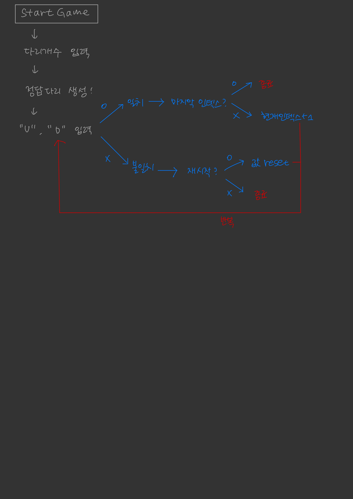

## 오늘의 회고 ヾ(•ω•`)o

### 테스트로 다시 느낀 MVC 패턴의 필요성

<br>

### 느낀점(?) 😃

<em>사실 어제 적었어야 했는데 어제 리팩토링을 마무리짓기로 결심하여 오늘 적어본다...</em>

이번에 기능 구현 후에 계속 마음에 걸렸던 부분이 있었다. 주어진 조건 덕에 값을 저장하고 관리하는 컨트롤러를 생성했는데 문제는 이 친구가 모든 일을 하다보니 의존성이 커지고 비대해졌다는 점이다.
<br>
(예를 들면 알바를 하는데 손이 빠른 사람이 다른 사람들보다 압도적으로 잘해 이 사람이 모든 업무를 담당하는 것?)

그래서 테스트 코드를 작성하는데 난감했다. (이 문제를 항상 겪는 것 같다.. 기능 분리가 너무 어렵다..) 그래서 마음을 먹고 컨트롤러에서 모델을 분리해오자고 결심했다!

원래 BridgeDraw는 o,x,|를 찍어주는 enum이었는데 너무 활용도가 떨어져서 클래스로 바꾸고 이 BridgeDraw함수에서 출력 map들을 관리하고 그림을 그려주도록 했다. (이게 훨 편했다!!) 그리고 String에는 join이라는 함수가 있는데

```(java)
List<String> up = new ArrayList<>(Arrays.asList("O",""));
String letter = String.join("|", up)
```

이런 식으로 인덱스 값 사이에 |를 찍은 문자열 형태로 합쳐준다!!
output클래스에서 이렇게 바꿔주니까 한층 로직이 쉬워졌다.. 진작에 이런 걸 알아볼걸...

BridgeGame함수에는 재시작 횟수를 세주는 변수와, 정답 다리 리스트, 인덱스 변수가 담겨있다.
여기서 move, retry함수로 새로 바꿔주었다.
<br>
(우테코 분들께서 이 함수를 이용하라고 했던 목적과는 정말 다르게 사용했기 때문에... 아무래도 나 외국인.....?)
<br>
move함수에는 현재 인덱스 값을 더해주는 것, retry함수에는 재시작 횟수를 1 더해주고 현재 인덱스 값을 0으로 초기화 해주는 것으로 두었다.
<br>
(테스트 하면서 move함수에서 끝 인덱스면 move가 일어나지 못하게 해야 함을 알고 변경했다!!!!!!)

이렇게 변수들을 모델에 지정해주고 컨트롤러를 손대려고 하니 한층 편해졌다. 값과 이 값을 실질적으로 다루는 로직들이 바깥에 빠졌기 때문에 원래 생각한 대로 컨트롤러에서는 입력받은 값을 통해 상황을 분리해주기만 하면 되었다.
<br>
(tmi. 사실 여기서 메서드명을 짓는데 골머리를 앓았지만 이건 항상 리팩토링을 하며 겪는 문제이기 때문에 한탄하진 않겠다)

<br>

